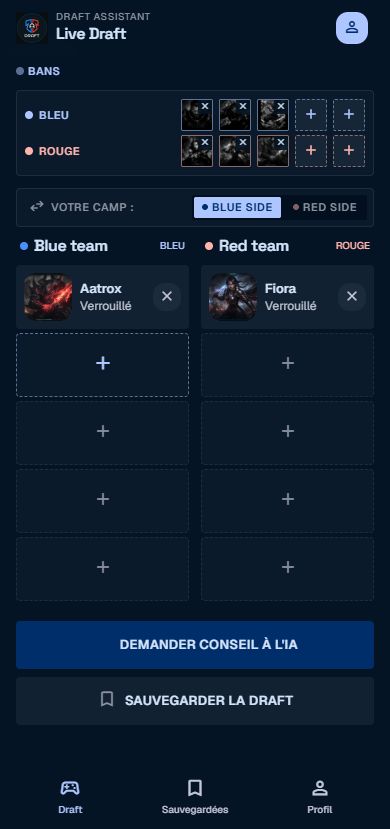
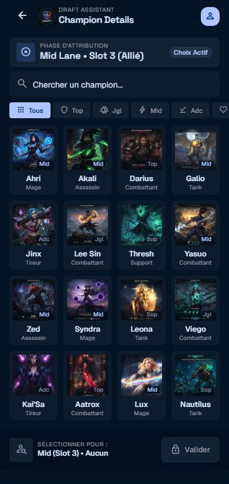
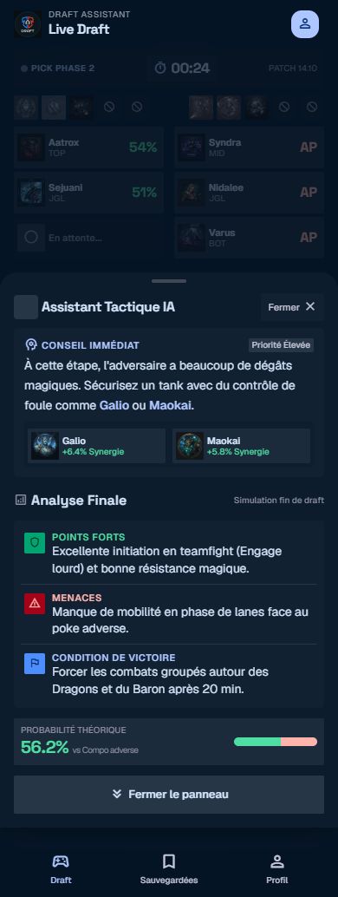
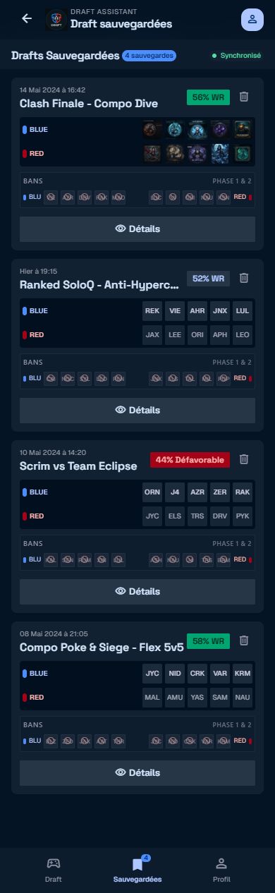
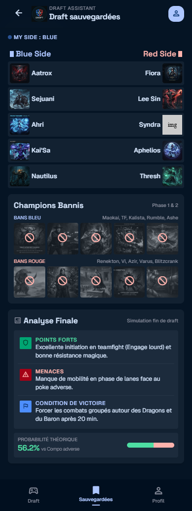
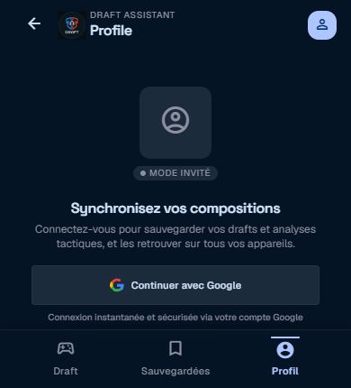
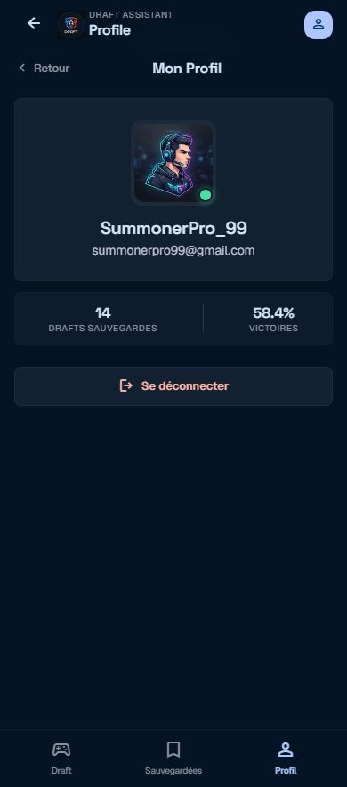

# Draft Assistant

Draft Assistant est une application Flutter qui aide un joueur de League of Legends à analyser une composition de draft. Elle permet de choisir les bans et champions des équipes bleue et rouge, de consulter les champions disponibles, de demander une analyse générée par Firebase AI et de sauvegarder ses drafts.

## Démonstration

Une vidéo de démonstration de l'application est disponible sur YouTube :

[Voir la vidéo de démonstration de Draft Assistant](https://youtu.be/0r0fIyuhh-Q)

## Fonctionnalités

- Draft interactive avec 5 bans et 5 champions par équipe.
- Prévention des doublons entre les slots.
- Recherche depuis le catalogue Data Dragon.
- Analyse IA en français : résumé, forces, faiblesses, condition de victoire, estimation de win rate et conseils de champions.
- Authentification Google via Firebase Authentication.
- Sauvegarde distante dans Cloud Firestore pour les utilisateurs connectés.
- Sauvegarde locale ObjectBox utilisée lorsque Firestore est inaccessible.
- Navigation Flutter entre draft, drafts sauvegardées, détail de draft, profil et liste des champions.

## Stack technique

| Domaine | Technologie |
| --- | --- |
| Interface | Flutter / Dart |
| État | Riverpod |
| Navigation | GoRouter |
| Authentification | Firebase Authentication + Google Sign-In |
| Données distantes | Cloud Firestore |
| Analyse | Firebase AI, `gemini-3.5-flash-lite` |
| Catalogue | Riot Data Dragon via Dio |
| Cache local | ObjectBox |
| Protection | Firebase App Check |

Le lancement nécessite une configuration Firebase valide et, pour Google Sign-In, `GOOGLE_CLIENT_ID`. Voir [le guide de configuration](docs/setup_guide.md).

## Maquette

### Draft active



### Sélection d’un champion



### Analyse IA



### Sauvegarde des drafts





### Profil utilisateur





## Documentation

- [Guide de configuration et de lancement](docs/setup_guide.md)
- [Architecture et flux de données](docs/architecture.md)
- [Contrats des endpoints et services](docs/api_contracts.md)


## Tests et qualité

```bash
flutter test
```
