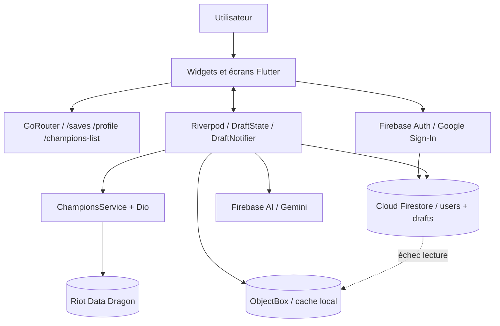

# Architecture et flux de données

## Vue d’ensemble

Draft Assistant est une application Flutter organisée autour de trois zones :

1. **Présentation** : écrans et widgets Flutter, navigation GoRouter.
2. **État applicatif** : Riverpod conserve la draft en cours et son état de chargement.
3. **Services** : Firebase, Data Dragon et ObjectBox fournissent les données externes ou persistantes.

## Initialisation

`main()` initialise Flutter et Firebase, active App Check, ouvre ObjectBox dans le répertoire de documents de l’application, puis injecte `ObjectBoxService` dans Riverpod avant de monter `MaterialApp.router`.

## État d’une draft

`DraftState` contient les sélections par `DraftSlot`, les recherches par slot, l’équipe de l’utilisateur, le dernier conseil IA et les états de chargement. `DraftNotifier` refuse les doublons, gère la sélection/désélection, demande l’analyse et délègue la persistance.

## Flux de consultation des champions

1. `championsProvider` demande les données à `ChampionsService`.
2. `ChampionsService` appelle Data Dragon avec Dio.
3. Le champ `data` est converti en objets `Champions`.
4. Le modèle construit l’URL d’image du champion.
5. Les widgets filtrent et affichent le catalogue.

La version Data Dragon est actuellement fixée à `13.1.1` dans le code source.

## Flux d’analyse IA

1. L’utilisateur demande un conseil depuis la draft.
2. `DraftNotifier` verrouille l’action avec `isGeneratingAdvice`.
3. `buildPrompt()` encode équipe, champions, bans et complétude.
4. Firebase AI appelle `gemini-3.5-flash-lite`.
5. `DraftAdvice.fromJson` parse la réponse JSON.
6. Une réponse vide ou invalide renseigne `aiError`.
7. L’interface affiche le conseil.

Le modèle estime un `win_rate` théorique.

## Flux de sauvegarde

1. La draft est convertie en document `drafts/{draftId}`.
2. Le document contient utilisateur, timestamps, équipe, sélections et conseil IA.
3. L’identifiant est ajouté à `users/{uid}.draftIds` avec `arrayUnion`.
4. Une copie est écrite dans ObjectBox sous forme de JSON.
5. Firestore est prioritaire à la lecture ; en cas d’échec, ObjectBox fournit les drafts locales avec un identifiant `local-{id}`.

## Routes applicatives

| Route | Écran | Paramètres |
| --- | --- | --- |
| `/` | Draft live | Aucun |
| `/saves` | Drafts sauvegardées | Aucun |
| `/saves/:draftId` | Détail d’une draft | ID distant ou `local-{id}` |
| `/profile` | Profil et authentification | Aucun |
| `/champions-list` | Catalogue de champions | Query `slot` |

## Responsabilités des couches

- `screens/` compose les écrans et leurs états visuels.
- `widgets/` contient les composants réutilisables.
- `providers/` expose l’état Riverpod.
- `services/` encapsule Firebase, Data Dragon, IA et ObjectBox.
- `models/` définit les objets métier et l’entité ObjectBox.
- `router/` centralise les routes de navigation.
